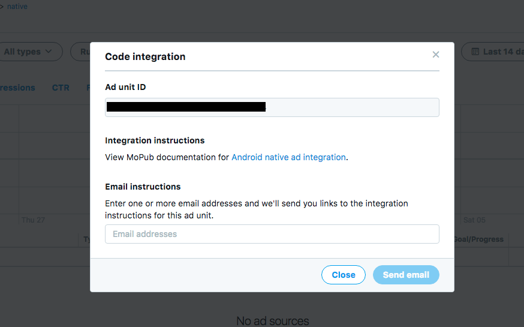

# Ads

[MoPub](#MoPub)

[Facebook](#Facebook)

[Yahoo! Flurry](#Yahoo!-Flurry)

---

## MoPub

[Resources](#Resources)

[General Setup](#General-Setup)

[Android](../android/mopub-android.md)

[Flutter](../flutter/mopub-flutter.md)

[Sources](#Sources)

[Organize With Segments](#Organize-With-Segments)

[Native](#Native)

[Native Video](https://developers.mopub.com/docs/android/native-video/)

---

### Resources

**Community**

[Twitter Forum](https://twittercommunity.com/)

**Documentation**

[Publisher UI](https://developers.mopub.com/docs/ui/)

[Mediation](https://developers.mopub.com/docs/mediation/)

   - [Integrate MoPub Mediation Adapters](https://developers.mopub.com/docs/mediation/integrate/)

[Testing](https://developers.mopub.com/docs/android/testing/)

### General Setup

1. Add app.
2. Add ad unit.
3. Add network (include [placement id](#setup)), marketplace (if app is live), or direct order.
4. Add segment. (targeting optional)

### Sources
#### Marketplace

   About: Advertisers bid against each other for placements through _DSPs_ (Demand Side Partners).

   [Documentation](https://developers.mopub.com/docs/ui/marketplace/)

#### Networks

   About: Show ads from specific networks using mediation for competitive bidding.

   [Networks](https://developers.mopub.com/docs/ui/networks/)
   
   [Mediation](https://developers.mopub.com/docs/mediation/)

   Best practices
   - Use unique network IDs (same as placement id) per ad unit. 
   - Reduce [latency](https://developers.mopub.com/docs/mediation/waterfall-latency-and-best-practices/#latency-types-summary)
      - Minimize ad sources in waterfall. (ie:  removing low-CPM and low-fill network partners)
      - Set items at the same priority to parallelize requests improving latency and CPMs due to competition. 

#### Orders & Line Items

   About: Direct sale or in-house ads.

   [Documentation](https://developers.mopub.com/docs/ui/orders/#line-item-types)

- Guaranteed: Will always show. Used for direct buys. _Default is Priority 6_
- Promotional: House ads or in-app purchases. _Default Priority 10_
- Marketplace: Set a geo floor price for marketplace, or to prioritize Marketplace higher than network campaigns. _Default Priority 10_
- Network: One-time network campaign at a higher priority than your other network campaigns. Used to run a network with limited budget or time period. _Default Priority 10_
- Non-Guaranteed: Campaign without a guaranteed number of impressions. _Default Priority 12_
- Backfill: Promotional line item like house ads. _Default lowest Priority level, 16_

   ##### Targeting
   [Documentation](https://developers.mopub.com/docs/ui/orders/line-item-targeting/)

   - Geo
   - Installed apps (that you own)
   - Custom data (sent from client)

### Organize With Segments

[Documentation](https://developers.mopub.com/docs/ui/segments/)

Grouping
- Ad units/Apps
- Ad networks
- Geography

Best Practices

- Assign CPM to each segment and containing units/networks.
- Don't overlap segments.
- Each country is only present in a single segment in order to see complete network waterfall in one segment.

### Native

[Supported Networks Chart](https://developers.mopub.com/docs/mediation/supported-mediation-partners/)

[Best Practices](https://developers.mopub.com/docs/publisher/best-practices/native-ads/)

#### Attributes

- Frequency Caps (per user)
   - hourly impressions
   - daily impressions

- Ad Positions: show ads every _number_.

**Test**

Setup direct campaign from [_Orders_](https://developers.mopub.com/docs/ui/orders/) tab.

or

Use ad unit ID with sample ads: 76a3fefaced247959582d2d2df6f4757

#### Ad Unit Ids

_Apps_ > _appName_ > _adUnitName_ > _Edit Ad Unit_ > _View code integration_

## Facebook

[Resources](#Resources)

[Setup](#Setup)

[Testing](#Testing)

[Native Design Requirements](https://developers.facebook.com/docs/audience-network/guidelines/native-ads)

---

### Resources

[Business Manager](https://business.facebook.com/) > Monetization Manager

[MoPub - Mediate Facebook](https://developers.mopub.com/docs/mediation/networks/facebook/)

[Native ad design guidelines](https://developers.facebook.com/docs/audience-network/guidelines/native-ads)

[System User Token Generation](https://developers.facebook.com/docs/audience-network/reporting-api/systemuser/) (Used for MoPub reporting)

### Setup

[Monetize Your App With Audience Network](https://www.facebook.com/help/publisher/1195459597167215)
   1. Create ad placement
      1. Create placement ID (Required for MoPub): _Business Manager_ > _Monetization Manager_ > _Create Property_ > add platform > _Create Ad Space_ > _Copy ID_
      2. Setup payment: _Your app won't be able to receive Audience Network ads until payout information has been added._
   2. Manage placements: _Business Manager_ > _Monetization Manager_ > select property > _Manage Property_
   3. Create [system user token](https://developers.facebook.com/docs/audience-network/reporting-api/systemuser#systemuser) for reporting. (_Only those apps with Live status can be used to generate System User Access Token._)

### Testing
 [Testing Audience Network Implementation](https://developers.facebook.com/docs/audience-network/testing/#testing-real)
- [Test Devices](https://business.facebook.com/pub/testdevices?business_id=2451110181597794)
- [Ad Request Debugger](https://business.facebook.com/pub/property/request_debugger?business_id=2451110181597794&property_id=1189190221239799)

Device IDFA/AAID: _Settings_>_Google_>_Ads_>_Your advertising ID: ####_

## Yahoo! Flurry

[Flurry Dashboard](https://dev.flurry.com/metrics/)

**Documentation**

[Monetization](https://developer.yahoo.com/flurry/docs/publisher/)

[Native Dashboard Configuration](https://developer.yahoo.com/flurry/docs/publisher/gettingstarted/nativeadsetup/)

[Acquire the API access token](https://developer.yahoo.com/flurry/docs/api/code/apptoken/) (Used for MoPub reporting)

[Error Codes](https://developer.yahoo.com/flurry/docs/faq/faqpublisher/android/#android-error-codes)

Sample - [flurry/YodelAndroidApp](https://github.com/flurry/YodelAndroidApp)