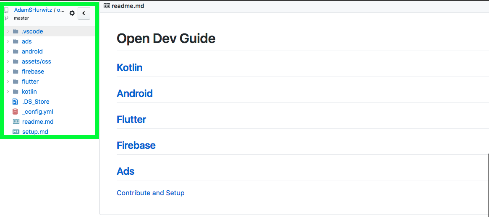

# Setup

1. View guide hiearchy nicely using the [Octotree](https://chrome.google.com/webstore/detail/octotree/bkhaagjahfmjljalopjnoealnfndnagc/related?hl=en-US) Chrome extension.

2. Clone or download [the project](https://github.com/AdamSHurwitz/open-dev-guide) locally from GitHub.

3. Edit guides using Markdown with your IDE of choice: [Visual Studio Code](https://code.visualstudio.com/): [Markdown and Visual Studio Code](https://code.visualstudio.com/docs/languages/markdown) is a solid option.

4. [Contribute](https://github.com/AdamSHurwitz/app-dev-guide) to this guide by submitting a [pull request](https://github.com/AdamSHurwitz/open-dev-guide/pulls).

_Consistent high quality contributors may be granted access to modify guides without submitting pull requests._